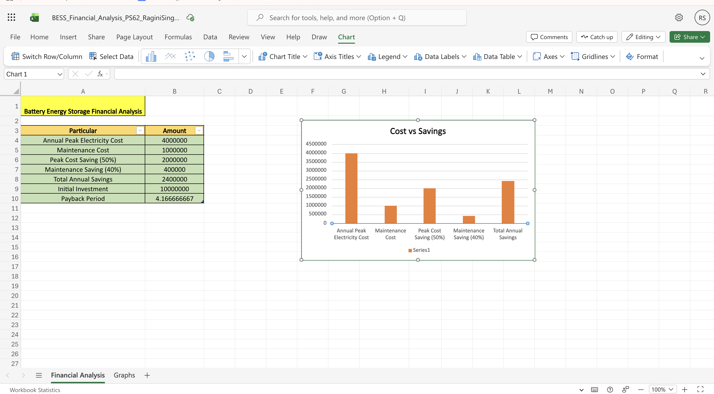
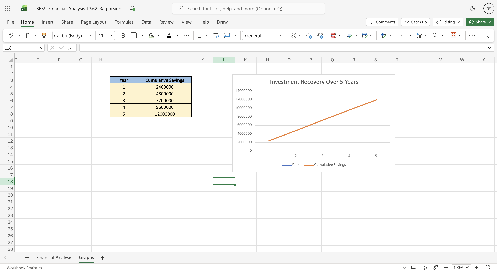

# 🔋 Battery Energy Storage System (BESS) – Business Case Study
---

<p align="center">

<a href="https://1drv.ms/w/c/843cce1f097d9ae9/IQCUaOPEalMBQKuFgi2c7a3bAQazJYK-QlqwTOmT49gyaxY?e=T6ebdi">

</a>

<a href="https://1drv.ms/x/c/843cce1f097d9ae9/IQBaAzoiLZGkRrGuZi2ZBR8xATFIxDoRYDgKXln_lYYVPDE?e=1wWcrn">

</a>

<a href="https://github.com/RaginiSingh2024/Battery-Energy-Storage-Business-CaseStudy">

</a>

</p>

---

## 🔗 External Links

- 📊 **Live Dashboard:** https://battery-energy-storage-business-casestudy-mcsyliewxxu3nwnhvopd.streamlit.app
- 📄 **Case Study Report:**  👉 [Download Business Case Study Report](./Business_CaseStudy_PS62_RaginiSingh.pdf)
- 📈 **Excel Financial Analysis (View Online):** 
👉 https://1drv.ms/x/c/843cce1f097d9ae9/IQBaAzoiLZGkRrGuZi2ZBR8xATFIxDoRYDgKXln_lYYVPDE?e=jQY8gn
- 📥 **Excel Financial Analysis (Download):** 
👉 [Download Excel File](./BESS_Financial_Analysis_PS62_RaginiSingh.xlsx)
- 📂 **Dataset Source:** https://www.kaggle.com/datasets/robikscube/hourly-energy-consumption
- 💻 **GitHub Repository:** https://github.com/RaginiSingh2024/Battery-Energy-Storage-Business-CaseStudy  

---

## Overview
This repository contains the complete business case study analysis for implementing a Battery Energy Storage System (BESS) for a small city facing power fluctuations and high peak electricity costs.

The objective of this study is to analyze financial feasibility, operational benefits, and long-term sustainability of investing in a battery energy storage system.

## Project Visualization

### Cost vs Savings Analysis



### Investment Recovery Over 5 Years




## Problem Statement

PowerStore Solutions plans to implement a Battery Energy Storage System (BESS) to manage peak electricity demand and store renewable energy. The city currently faces frequent power fluctuations and high peak-time electricity costs.

The goal of this study is to analyze the financial feasibility and operational impact of investing ₹1 Crore in a battery storage infrastructure.

## Objectives

- Analyze electricity cost reduction using BESS
- Estimate annual savings from peak cost reduction
- Evaluate maintenance cost savings
- Calculate payback period for the investment
- Visualize financial insights using graphs


  ## Financial Analysis

The financial model estimates cost savings by reducing peak electricity usage and maintenance expenses.

Key assumptions:

- Annual Peak Electricity Cost: ₹40,00,000
- Maintenance Cost: ₹10,00,000
- Peak Cost Reduction: 50%
- Maintenance Cost Reduction: 40%

  ## Key Results

| Parameter | Value |
|----------|------|
| Annual Savings | ₹24,00,000 |
| Initial Investment | ₹1,00,00,000 |
| Payback Period | ~4.16 Years |

## Tools Used

- Microsoft Excel
- Microsoft Word
- Data Visualization using Charts

  
## Case Study Details
- Subject: Business Studies
- Problem Statement: PS-62
- Topic: Battery Energy Storage System (BESS)
- Investment Considered: ₹1 Crore


## 📄 Case Study Report

Click below to view the full report:

👉 [Download Business Case Study Report](./Business_CaseStudy_PS62_RaginiSingh.pdf)

---

## 📊 Excel Financial Analysis

The Excel sheet contains financial calculations including:

- Peak electricity cost analysis
- Maintenance cost savings
- Payback period calculation
- Graphical visualization

👉 [Open Excel Financial Analysis](./BESS_Financial_Analysis_PS62_RaginiSingh.xlsx)

---

## 📈 Graph Analysis

### Cost vs Savings Analysis


---

### Investment Recovery Over 5 Years


---

## 📊 Financial Summary

| Parameter | Value |
|-----------|------|
| Annual Savings | ₹24,00,000 |
| Initial Investment | ₹1,00,00,000 |
| Payback Period | ~4.16 Years |

---

## Business Impact

The implementation of a Battery Energy Storage System (BESS) can significantly improve grid reliability by stabilizing power supply during peak demand periods.

Key benefits include:

• Reduced peak electricity costs  
• Improved energy efficiency  
• Better utilization of renewable energy  
• Increased grid stability


## Financial Analysis
The analysis estimates annual savings by reducing peak-time electricity costs and maintenance costs.

Key results:
- Annual Savings: ₹24,00,000
- Investment: ₹1,00,00,000
- Payback Period: ~4.16 years

## Files Included

### 1. Business Case Study Report
`Business_CaseStudy_PS62_RaginiSingh.pdf`

Contains complete academic analysis including:
- Introduction
- Problem Statement
- Objectives
- Financial Analysis
- Technical Analysis
- Business Impact
- Recommendation & Conclusion

### 2. Excel Financial Model
`BESS_Financial_Analysis_PS62_RaginiSingh.xlsx`

Includes:
- Financial calculations
- Payback period formula
- Data tables
- Graphical analysis

### 3. Graphs
- Cost vs Savings Analysis
- Investment Recovery Over 5 Years

## Tools Used
- Microsoft Excel
- Microsoft Word
- Data Visualization using Charts

  ### Topics
business-case-study
energy-storage
excel-analysis
financial-analysis
data-visualization


## 📁 Repository Structure

```
BESS-Business-CaseStudy-PS62/
│
├── 📄 Business_CaseStudy_PS62_RaginiSingh.pdf
├── 📊 BESS_Financial_Analysis_PS62_RaginiSingh.xlsx
│
├── 📁 graphs/
│   ├── 📈 cost_vs_savings.png
│   └── 📉 investment_recovery.png
│
└── 📘 README.md
```

## 🔗 Repository Link

View the complete project here:

👉 https://github.com/RaginiSingh2024/Battery-Energy-Storage-Business-CaseStudy


## Conclusion

Based on the financial analysis and projected savings, the investment of ₹1 Crore in a Battery Energy Storage System is financially feasible.

The estimated payback period of approximately 4.16 years indicates that the project can provide long-term economic and operational benefits for the city.


## 👩‍💻 Author

**Ragini Singh**  
B.Tech CSE  
Business Studies Case Study – PS62
Sem IV Sprint 1 

---


